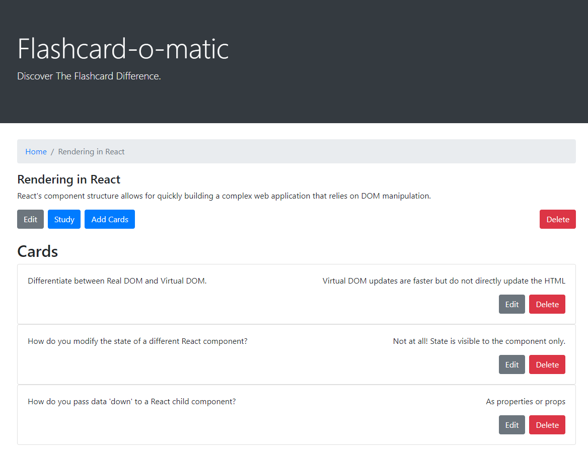
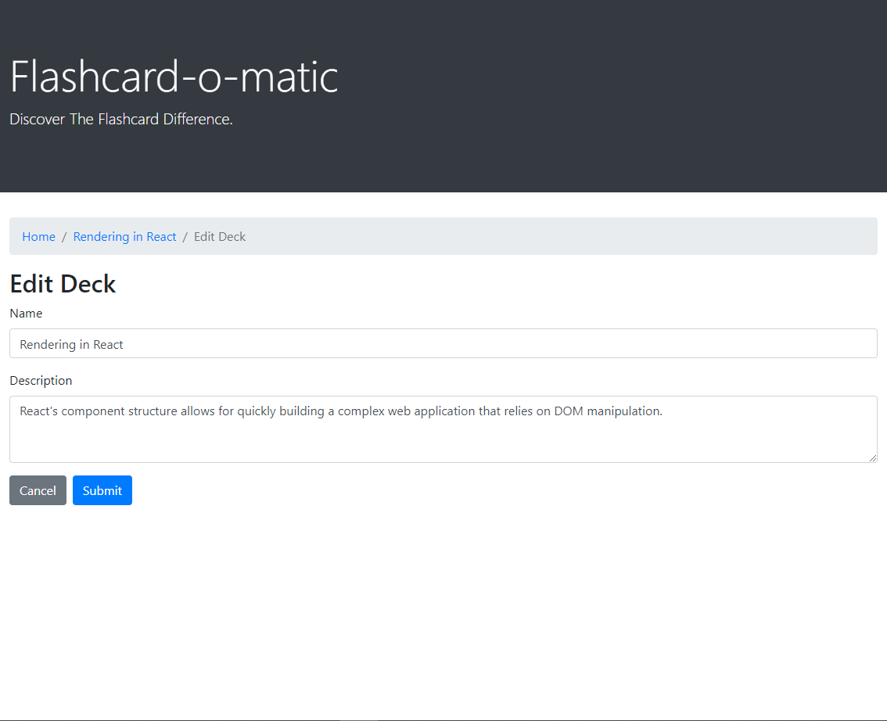
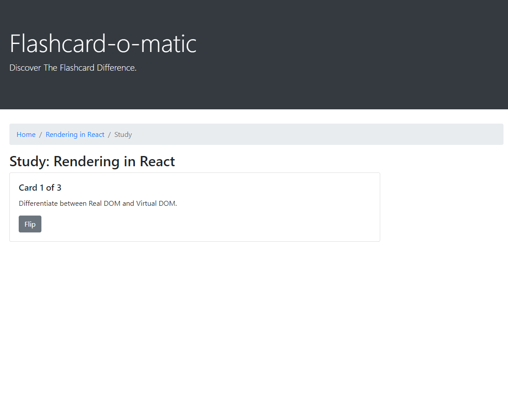

# Flashcard-App

Flashcard App is for users that wish to create flashcard decks to review any topic digitally.

## Links

* [App Demo]()
* [Api comming soon]()

## Installation

1. Run `npm install` to install project dependencies.
1. Run `npm run start` to start project

The deafult URL locations will be http://localhost:3000.

## Screenshots

### Home Page:

Shows decks that have already been created.

### Create Deck:

### View Deck:

Shows all of the cards associated to that specific deck as well as deck and card management functionality.

### Edit Deck:

### Add Card:

### Edit Card:

### Study Card:

Front side of card

Flipping card shows the back of card as well as next button to continue to next card

## Technology

### Built with:
* REACT, including router & Bootstrap
  * Created with create-react-app

### API interface:
* An API server, powered by [json-server](https://www.npmjs.com/package/json-server), running on http://localhost:5000
